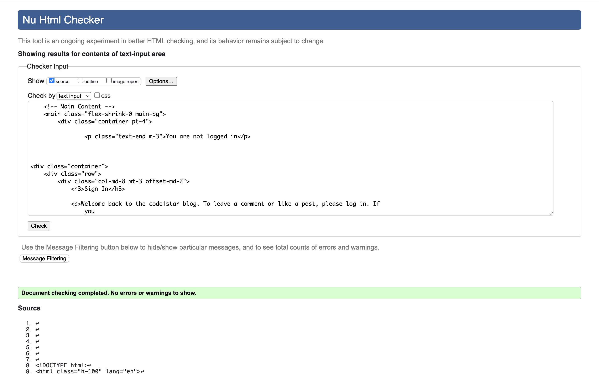

# 💊 Django Medication Tracker

Medication Tracker is a web app designed to help users manage and track their personal medication schedules with ease and reliability.

Unregistered users can access the homepage to learn more about the purpose of the app and its features. To begin using the app, users must register an account via the sign-up form. Once registered, users can securely log in to access the full functionality of the tracker.

Logged-in users can create new medication entries, browse a list of all their current medications, and update or delete existing entries as needed. Each medication record includes details such as name, dosage, frequency, and instructions.

From their personalized dashboard, users have a clear view of all active medications and their status. The clean, responsive design ensures a smooth experience across devices, whether managing prescriptions at home or on the go.

Medication data is securely stored and managed through the backend, built with Django. The admin panel allows site administrators to oversee all user activity, manage medications, and perform data maintenance tasks as needed.

This project is ideal for individuals seeking a straightforward, user-friendly tool to support their health routine and medication adherence.

---

## 🚀 Features

- User authentication (login/register/logout)
- Create, update, and delete medications
- Report side effects per medication
- Side effect category options (dropdown)
- Admin dashboard with:
  - Total medication and side effect counts
- Admin access control for dashboard visibility

---

## 📄 Pages & Functionality Overview

### 🏠 Home Page

The home page is accessible to all users, including those not logged in. It provides an overview of the application's purpose and features, encouraging users to register or log in to access full functionality. It offers detailed information about the application's benefits and how it assists users in managing their medications effectively.

---

## 👤 User Management

### Registration & Signup  
New users register with a comprehensive signup form extending Django Allauth’s default signup by requiring first name, last name, gender, age, and country of residence. Gender is selected from predefined choices: Male, Female, or Other. Country selection leverages the `django-countries` package, presenting a dropdown list of countries for standardized input. Age is entered as a positive integer. These fields are saved in an associated `UserProfile` model linked to the user account.

### Login  
Users log in using their email and password credentials. Validation ensures secure authentication with appropriate error feedback.

### Profile Page  
Once logged in, users access their profile page displaying personal info alongside a list of their current medications. Profiles can be edited to update demographic info or account details.

---

## 💊 Medication Management

Users manage their medications through a user-friendly interface:

- **Add Medication:** Users add medications by filling a form with fields for medication name, dosage (e.g., “500mg”), frequency (times per day), start and end dates, and selecting a health category from a dropdown list. Categories include Joints and Muscles, Gut Health, Skin, Eyes-Ears-Nose-Throat, Headaches and Dizziness, and Heart Health, ensuring consistent classification of medication purposes.

- **View Medications:** The app displays medications in a paginated list, showing all relevant details. Each medication is tied to the logged-in user, enforcing privacy.

- **Edit & Delete:** Users can update or remove medications they previously added. Forms are pre-populated with current data for ease of editing. Deletions prompt confirmation to prevent accidental loss.

Medication entries are sorted by creation date, showing the newest first for quick access to recent records.

---

## ⚠️ Side Effect Reporting

Users can report side effects experienced from medications via a dedicated form:

- **Side Effect Categories:** Side effects are selected from predefined categories such as Nausea or Vomiting, Fatigue or Weakness, Rashes or Skin Issues, Mood Changes, Muscle or Joint Pain, and Heart Palpitations or Chest Pain. This dropdown ensures standardized data input.

- **Detailed Descriptions:** Users provide detailed textual descriptions explaining their symptoms or experiences.

Side effects are linked to both the user and the specific medication. Reports are displayed grouped by medication on the medication list page. Users can delete their side effect entries with confirmation prompts, maintaining control over their data.

---

## 📊 Admin Dashboard & Analytics

Administrators access a comprehensive dashboard presenting aggregated insights on medication usage and side effect reports:

- **Totals & Trends:** The dashboard displays overall counts of medications and side effects recorded.

- **Category Breakdown:** Data is grouped by health categories for medications and side effect categories, showing the most common entries.

- **Demographic Filters:** Leveraging extended user profile data (gender, age, country), the dashboard offers filtering options by gender (Male, Female, Other, All). This segmentation provides targeted analytics to uncover trends or issues specific to demographic groups.

- **Raw SQL Queries:** The app uses optimized raw SQL queries to aggregate data efficiently, joining medication and side effect records with user profiles.

This rich, dynamic dashboard supports better monitoring and informed decision-making to improve user health management.

---

## ⚙️ Technical Details

- **Models:** The `Medication` model stores medication details, user linkage, and category selections. The `SideEffect` model links side effects to medications and users, with categorized types and descriptions. User demographic data is stored separately in a `UserProfile` model extending Django’s default User.

- **Forms:** Custom forms leverage Django’s forms framework with styled widgets for consistent UI:
  - `CustomSignupForm` extends Django Allauth signup, adding fields for first name, last name, gender (dropdown), age, and country (using django-countries).
  - `MedicationForm` handles medication data entry with input validation and dropdowns for categories.
  - `SideEffectForm` manages side effect reporting, with dropdown selection and a textarea for detailed descriptions.

- **Views:** Class-based views handle listing, creating, updating, and deleting medications with user access control. Side effect reporting and deletion include POST handling with messages for success/failure feedback. The admin dashboard view uses raw SQL and staff-only access restrictions.

- **User Experience:** Pagination, dropdown menus, and confirmation prompts ensure ease of use and prevent accidental data loss. Side effects are displayed grouped by medication for context.


---

## 🗂️ Project Structure Highlights

```
```
---

## Wireframes

Wireframes were created in Uiwizard. They were used for initial planning of template layouts.

<details>
<summary>Index Wireframe</summary>


</details>

<details>
<summary>Medication Wireframe</summary>


</details>

<details>
<summary>Admin Dashboard Wireframe</summary>


</details>

<details>
<summary>Registration Page Wireframe</summary>


</details>

---

# Testing


## [HTML Validator](https://validator.w3.org/)

HTML was validated by copying the page source and pasting into the validator.

- <details>
  <summary>Index Results</summary>


  </details>

- <details>
  <summary>Add Medication Results</summary>


  </details>

- <details>
  <summary>View Medication Results</summary>


  </details>

- <details>
  <summary>Signup Results</summary>


  </details>

## 🧠 Models Overview

### Medication
```python
class Medication(models.Model):
    user = models.ForeignKey(User, on_delete=models.CASCADE, related_name='medications')
    name = models.CharField(max_length=100)
    dosage = models.CharField(max_length=50)
    frequency = models.IntegerField()
    start_date = models.DateField()
    end_date = models.DateField()
    category = models.CharField(choices=HEALTH_CATEGORIES)
    ...
```

### SideEffect
```python
class SideEffect(models.Model):
    medication = models.ForeignKey(Medication, on_delete=models.CASCADE, related_name='side_effects')
    user = models.ForeignKey(User, on_delete=models.CASCADE)
    category = models.CharField(choices=SIDE_EFFECT_CATEGORIES)
    description = models.TextField()
    reported_on = models.DateTimeField(auto_now_add=True)
```

---

## 📊 Admin Dashboard (Superusers Only)

### View (`views.py`)
```python
def dashboard(request):
    if not request.user.is_superuser:
        return redirect('home')

    total_medications = Medication.objects.count()
    total_side_effects = SideEffect.objects.count()
    most_common_side_effects = SideEffect.objects.values('category')         .annotate(count=models.Count('category'))         .order_by('-count')[:5]

    return render(request, 'medication_tracker/dashboard.html', {
        'total_medications': total_medications,
        'total_side_effects': total_side_effects,
        'most_common_side_effects': most_common_side_effects,
    })
```

### Template (`dashboard.html`)
```html
<canvas id="sideEffectChart"></canvas>
<script src="https://cdn.jsdelivr.net/npm/chart.js"></script>
<script>
    const sideEffectData = {
        labels: ['{{ effect.category }}',],
        datasets: [{
            label: 'Side Effects Count',
            data: [{{ effect.count }},],
            backgroundColor: 'rgba(75, 192, 192, 0.2)',
            borderColor: 'rgba(75, 192, 192, 1)',
            borderWidth: 1
        }]
    };
    new Chart(document.getElementById('sideEffectChart'), {
        type: 'bar',
        data: sideEffectData,
        options: { scales: { y: { beginAtZero: true } } }
    });
</script>
```

---

## 🔐 Access Control

- **Dashboard** is only visible to superusers.
- Users can only manage their own medications and side effects.
- Superusers can view all medications and view extracted information in the dashboard.

---

## 🧩 Future Improvements

- Add date filtering to dashboard
- Export insights to CSV
- Introduce charts for medication adherence
- Integrate advanced filtering or user-level analytics

---

## 📸 Screenshot


---

## 📝 License

MIT License. See `LICENSE` for details.

---

## 🙌 Acknowledgments

Thanks to the Django and Chart.js communities for providing the tools that made this project possible.
