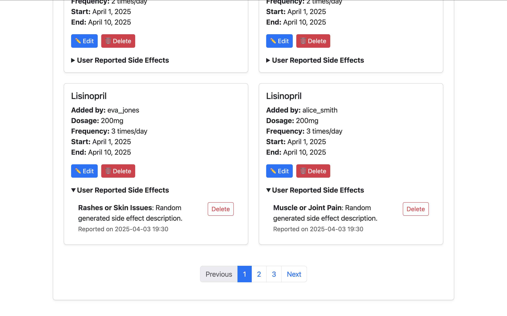

# 💊 Django Medication Tracker

Medication Tracker is a web app designed to help users manage and track their personal medication schedules with ease and reliability.

Unregistered users can access the homepage to learn more about the purpose of the app and its features. To begin using the app, users must register an account via the sign-up form. Once registered, users can securely log in to access the full functionality of the tracker.

Logged-in users can create new medication entries, browse a list of all their current medications, and update or delete existing entries as needed. Each medication record includes details such as name, dosage, frequency and the option to report side effects.

From their personalized dashboard, users have a clear view of all active medications and their status. The clean, responsive design ensures a smooth experience across devices, whether managing prescriptions at home or on the go.

Medication data is securely stored and managed through the backend, built with Django. The admin panel allows site administrators to oversee all user activity, manage medications, and perform data maintenance tasks as needed.

This project is ideal for individuals seeking a straightforward, user-friendly tool to support their health routine and medication adherence.

---

## 👤 User Stories

### 👩 Regular User

- **As a user**, I can register, log in, and log out securely.
- **As a user**, I can create, edit, and delete my medications.
- **As a user**, I can report side effects per medication.
- **As a user**, I can categorize my medications and side effects via dropdowns.
- **As a user**, I can view a paginated and sortable list of my medications.
- **As a user**, I can delete any previously reported side effect.
- **As a user**, I can only access my own data and not that of other users.

### 🛡 Admin User

- **As an admin**, I can access a dashboard with:
  - Total medication and side effect counts.
  - Top categories of medications and side effects.
  - Gender-based breakdowns of medications and side effects.
- **As an admin**, I can sort medication lists by username.
- **As an admin**, I can view and manage all user data.
- **As an admin**, I can only access the dashboard when logged in as a staff member.

---

## 📄 Pages & features

### 🧭 Navbar

The application features a responsive and role-aware navigation bar present across all main user-facing pages. Key characteristics include:

- Dynamic Links:
Links in the navbar adjust based on the user’s authentication status:

    - Logged-out users see: Login, Register.

    - Logged-in users see: Medications, Logout, and optionally their username or profile link.

    - Admin users see an additional link to the Admin Dashboard.

- Styling:
The navbar is styled using Bootstrap classes for responsiveness and includes clear visual cues for active pages.

- Accessibility & UX:
Mobile-friendly with a collapsible menu (navbar-toggler) and ARIA attributes for better screen reader support.

<details>
  <summary>Navbar</summary>


  </details>

---

### 🦶 Footer

A consistent footer is displayed across all views with the following features:

- Minimal Design:
A simple, fixed (or sticky) footer that displays copyright.

- Dynamic Year:
Uses Django’s template tags or context processors to render the current year automatically.

- Attribution & Branding (optional):
You may include site name, developer credit, or links to external documentation (e.g., GitHub repo, API info).

<details>
  <summary>Footer</summary>


  </details>

---

### 🏠 Home Page

The home page is accessible to all users, including those not logged in. It provides an overview of the application's purpose and features, encouraging users to register or log in to access full functionality. It offers detailed information about the application's benefits and how it assists users in managing their medications effectively.

- Django’s built-in authentication system handles registration, login, and logout.

- Medication and side effect data are filtered by the authenticated user — no other users can access or modify my data.

- Access control is enforced through LoginRequiredMixin and @login_required.

<details>
  <summary>Home Page</summary>


  </details>

<details>
  <summary>Home Page User</summary>


  </details>

<details>
  <summary>Home Page Admin</summary>


  </details>

---

## 👤 User Management

### Registration & Signup  

New users register with a comprehensive signup form extending Django Allauth’s default signup by requiring first name, last name, gender, age, and country of residence. Gender is selected from predefined choices: Male, Female, or Other. Country selection leverages the `django-countries` package, presenting a dropdown list of countries for standardized input. Age is entered as a positive integer. These fields are saved in an associated `UserProfile` model linked to the user account.

<details>
  <summary>Signup</summary>


  </details>

### Login  
Users log in using their email and password credentials. Validation ensures secure authentication with appropriate error feedback.

<details>
  <summary>Login</summary>


  </details>

### Logout  
Authenticated users can securely log out via the navigation bar. When clicked, a confirmation prompt ensures the user truly intends to sign out, helping to prevent accidental logouts. Upon confirmation, the session ends and the user is redirected to the homepage,

<details>
  <summary>Logout</summary>


  </details>

---

## 💊 Medication page

The Medication List page serves as the central hub where users can view all medications they have added. Each entry displays key details such as name, dosage, frequency, and treatment duration. Users can also report side effects, edit or delete medications, and view grouped side effects per medication. Admins can see all users' medications, while regular users only see their own.

<details>
  <summary>Medication user</summary>


  </details>

<details>
  <summary>Medication admin</summary>


  </details>

<details>
  <summary>Medication pagination</summary>


  </details>

### 💊 Create, update and delete medications

- **Add Medication!** Users manage their medications through a user-friendly interface. Users add medications by filling a form with fields for medication name, dosage (e.g., “500mg”), frequency (times per day), start and end dates, and selecting a health category from a dropdown list. Categories include Joints and Muscles, Gut Health, Skin, Eyes-Ears-Nose-Throat, Headaches and Dizziness, and Heart Health, ensuring consistent classification of medication purposes. They are able to record, edit, or remove medications they are taking to keep track of treatment accurately.

<details>
  <summary>Add Medication</summary>


  </details>

---

- **Edit & Delete:** Users can update or remove medications they previously added. Forms are pre-populated with current data for ease of editing. Deletions prompt confirmation to prevent accidental loss.

#### Features

- CreateView (MedicationCreate) allows logged-in users to add new medications.

- UpdateView (MedicationUpdate) allows users to edit only their own medications (or admins).

- DeleteView (MedicationDelete) allows users (or admins) to delete medications with confirmation.

- Medication data includes:

    - Name, Dosage, Frequency, Start/End Date, Category (dropdown), and optional Notes.

- Uses custom-styled form widgets (Bootstrap) for a clean UI.

### ⚠️  Reporting of side effects per medication

User are able to log any side effects they experience for specific medication so that they can track how treatments affect them. Users are able categorize side effects from a predefined list to ensure consistency and ensure that reporting is made easier.

#### Features

- From the medication list page, users can report side effects using the SideEffectForm.

- Each side effect is:

    - Linked to a specific medication.

    - Categorized via dropdown (SIDE_EFFECT_CATEGORIES): Nausea or Vomiting, Fatigue or Weakness, Rashes or Skin Issues, Mood Changes, Muscle or Joint Pain, Heart Palpitations or Chest Pain.

    - Users provide detailed textual descriptions explaining their symptoms or experiences.

- Reported side effects are stored with timestamps (reported_on) and associated with the reporting user.

### View medication and side effect lists

- The app displays medications in a paginated list, showing all relevant details. Each medication is tied to the logged-in user, enforcing privacy, while also allowing quick access and monitoring.

#### Features

- MedicationList displays:

    - User’s medications (or all for superusers).

    - Paginated with 6 items per page.

    - Includes sorting by name, user (admin only), and date created.

- Side effects are grouped and displayed under each medication using a dictionary (side_effects_by_med).

### Delete side effect lists

- Users are able to remove a previously reported side effect if it was added in error.

#### Features

- SideEffectDelete view provides deletion with access restricted to the original reporter.

- Confirmation template ensures no accidental deletions.

---

### Admin dashboard overview

- Admin users have access to a dashboard that gives me insight into medication and side effect usage patterns across all users.

#### Features

- Access restricted via @staff_member_required.

- Dashboard displays:

    - Total number of medications and side effects. The dashboard displays overall counts of medications and side effects recorded.

    - Top medication and side effects categories (global and by gender). Data is grouped by health categories for medications and side effect categories, showing the most common entries.

<details>
  <summary>Admin Dashboard Medications</summary>


  </details>

<details>
  <summary>Admin Dashboard Sideffect</summary>


  </details>

- Uses raw SQL queries for performance and flexibility. The app uses optimized raw SQL queries to aggregate data efficiently, joining medication and side effect records with user profiles.

- Admins are capable to analyze medication and side effect trends based on users' genders to understand how experiences vary. Data is grouped by Male, Female or Other. The visual grouping structure is prepared (gender_medication_data, gender_side_effect_data) and includes an “All” group for comparison across entire dataset.

<details>
  <summary>Admin Dashboard Filter</summary>


  </details>

<details>
  <summary>Admin Dashboard Filter</summary>


  </details>

---

## Security and access control

Only authenticated users can:

    View the medication list.

    Add, update, or delete medications and side effects.

Only superusers/admins can:

    View and sort by username.

    Access the admin dashboard.

Permissions enforced via:

    LoginRequiredMixin

    UserPassesTestMixin

    @login_required

    @staff_member_required

---

## Additional Features and Possibilities

### 🧬 User Profile Integration

Gender, age, and country are stored in a UserProfile model (via OneToOneField).

Enables demographic filtering (e.g., gender-based dashboard data).

Future potential:

    Localized medication advice.

    Age-specific health recommendations.

### 🌍 Country Data Support

CountryField allows easy integration of internationalization (e.g., filter medication by region or create country-based analytics).

### ✅ Future Suggestions

Allow users to export their medication logs (PDF/CSV).

Add reminders or alerts for medication schedules.

Include file uploads (e.g., prescriptions, images of side effects).

Allow doctor/caregiver roles to view assigned users' data.

Make use of Django signals to automatically create user profiles on registration.

---

## 📊 Admin Dashboard & Analytics

Administrators access a comprehensive dashboard presenting aggregated insights on medication usage and side effect reports:

- **Totals & Trends:** The dashboard displays overall counts of medications and side effects recorded.

- **Category Breakdown:** Data is grouped by health categories for medications and side effect categories, showing the most common entries.

- **Demographic Filters:** Leveraging extended user profile data (gender, age, country), the dashboard offers filtering options by gender (Male, Female, Other, All). This segmentation provides targeted analytics to uncover trends or issues specific to demographic groups.

- **Raw SQL Queries:** The app uses optimized raw SQL queries to aggregate data efficiently, joining medication and side effect records with user profiles.

This rich, dynamic dashboard supports better monitoring and informed decision-making to improve user health management.

---

## ⚙️ Technical Details

- **Models:** The `Medication` model stores medication details, user linkage, and category selections. The `SideEffect` model links side effects to medications and users, with categorized types and descriptions. User demographic data is stored separately in a `UserProfile` model extending Django’s default User.

- **Forms:** Custom forms leverage Django’s forms framework with styled widgets for consistent UI:
  - `CustomSignupForm` extends Django Allauth signup, adding fields for first name, last name, gender (dropdown), age, and country (using django-countries).
  - `MedicationForm` handles medication data entry with input validation and dropdowns for categories.
  - `SideEffectForm` manages side effect reporting, with dropdown selection and a textarea for detailed descriptions.

- **Views:** Class-based views handle listing, creating, updating, and deleting medications with user access control. Side effect reporting and deletion include POST handling with messages for success/failure feedback. The admin dashboard view uses raw SQL and staff-only access restrictions.

- **User Experience:** Pagination, dropdown menus, and confirmation prompts ensure ease of use and prevent accidental data loss. Side effects are displayed grouped by medication for context.

---

## 🎨 Project Design
This project combines clean visual design with full CRUD functionality to ensure an intuitive and user-friendly experience.

### 🛠 CRUD Functionality
The system is designed around standard Create, Read, Update, and Delete (CRUD) operations:

- Users can create and manage medications and report side effects.

- All entries can be viewed in list format, filtered and grouped for clarity.

- Items can be updated or deleted directly from the interface, with appropriate permission checks to ensure data integrity.

### 🌈 Color Scheme
- A minimal and accessible color palette is used, prioritizing readability and contrast.

- Bootstrap's default theme is extended with subtle custom styling for buttons, alerts, and form elements.

### 🔤 Typography
- The project uses Bootstrap’s base typography, which provides clean, responsive, and legible text styling across all devices.

- Headings and body text are clearly distinguished, with consistent font sizes and weights.

- Placeholders and form hints use smaller, muted text for subtle guidance without clutter.

### 🖼 Layout & Responsiveness
- The layout is mobile-first and fully responsive, built using Bootstrap’s grid system.

- Forms and lists resize smoothly across screen sizes — from phones to desktops.

- Navigation and tables adapt gracefully to small screens, maintaining usability.

### 🧭 UI Components
Common UI patterns are used to improve familiarity, including:

- A sticky navbar.

- Consistent form design.

- Flash messages (e.g., success/error alerts).

- Dropdowns for selecting categories.

---

## Wireframes

Wireframes were created in Uiwizard. They were used for initial planning of template layouts.

<details>
<summary>Index Wireframe</summary>


</details>

<details>
<summary>Medication Wireframe</summary>


</details>

<details>
<summary>Admin Dashboard Wireframe</summary>


</details>

<details>
<summary>Registration Page Wireframe</summary>


</details>

---

# Testing

## [HTML Validator](https://validator.w3.org/)

HTML was validated by copying the page source and pasting into the validator.

<details>
<summary>Index Results</summary>


</details>

<details>
<summary>Add Medication Results</summary>


</details>

<details>
<summary>View Medication Results</summary>


</details>

<details>
<summary>Signup Results</summary>


</details>

## 🧠 Models Overview

### Medication
```python
class Medication(models.Model):
    user = models.ForeignKey(User, on_delete=models.CASCADE, related_name='medications')
    name = models.CharField(max_length=100)
    dosage = models.CharField(max_length=50)
    frequency = models.IntegerField()
    start_date = models.DateField()
    end_date = models.DateField()
    category = models.CharField(choices=HEALTH_CATEGORIES)
    ...
```

### SideEffect
```python
class SideEffect(models.Model):
    medication = models.ForeignKey(Medication, on_delete=models.CASCADE, related_name='side_effects')
    user = models.ForeignKey(User, on_delete=models.CASCADE)
    category = models.CharField(choices=SIDE_EFFECT_CATEGORIES)
    description = models.TextField()
    reported_on = models.DateTimeField(auto_now_add=True)
```

---

## 📊 Admin Dashboard (Superusers Only)

### View (`views.py`)
```python
def dashboard(request):
    if not request.user.is_superuser:
        return redirect('home')

    total_medications = Medication.objects.count()
    total_side_effects = SideEffect.objects.count()
    most_common_side_effects = SideEffect.objects.values('category')         .annotate(count=models.Count('category'))         .order_by('-count')[:5]

    return render(request, 'medication_tracker/dashboard.html', {
        'total_medications': total_medications,
        'total_side_effects': total_side_effects,
        'most_common_side_effects': most_common_side_effects,
    })
```

### Template (`dashboard.html`)
```html
<canvas id="sideEffectChart"></canvas>
<script src="https://cdn.jsdelivr.net/npm/chart.js"></script>
<script>
    const sideEffectData = {
        labels: ['{{ effect.category }}',],
        datasets: [{
            label: 'Side Effects Count',
            data: [{{ effect.count }},],
            backgroundColor: 'rgba(75, 192, 192, 0.2)',
            borderColor: 'rgba(75, 192, 192, 1)',
            borderWidth: 1
        }]
    };
    new Chart(document.getElementById('sideEffectChart'), {
        type: 'bar',
        data: sideEffectData,
        options: { scales: { y: { beginAtZero: true } } }
    });
</script>
```

---

## 🔐 Access Control

- **Dashboard** is only visible to superusers.
- Users can only manage their own medications and side effects.
- Superusers can view all medications and view extracted information in the dashboard.

---

## 🧩 Future Improvements

- Add date filtering to dashboard
- Export insights to CSV
- Introduce charts for medication adherence
- Integrate advanced filtering or user-level analytics

---


