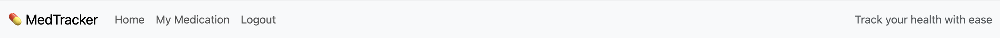
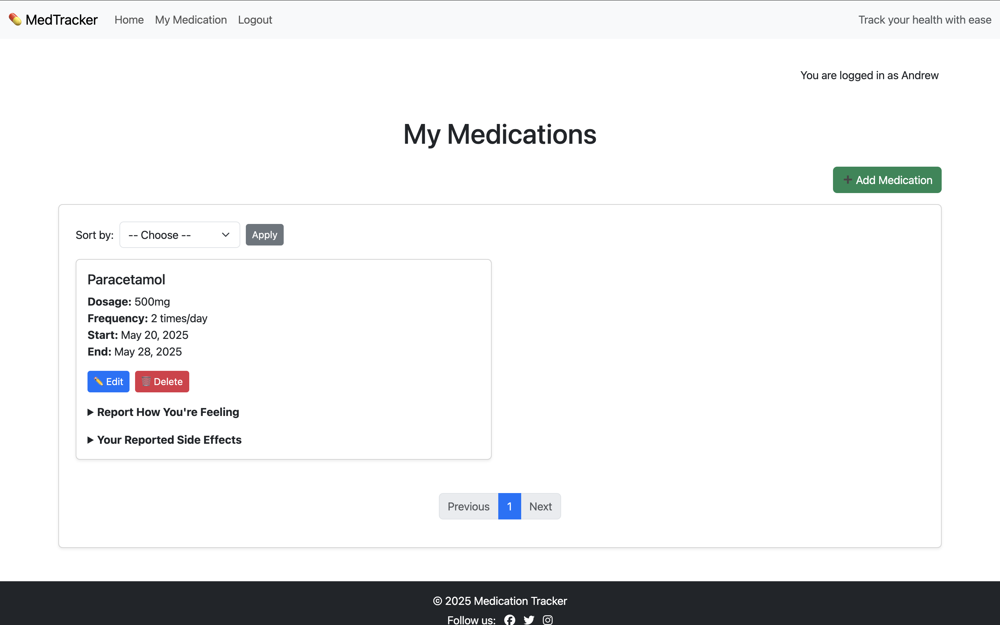
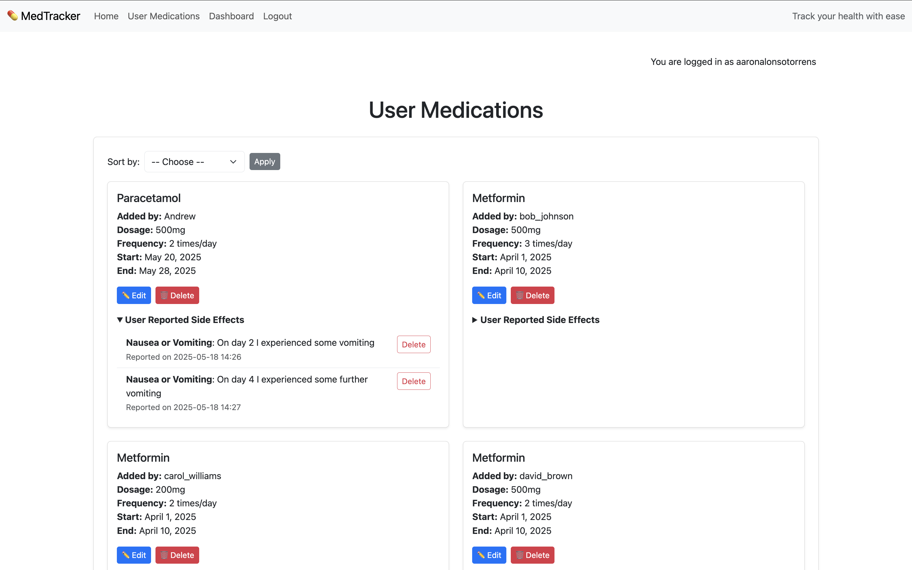
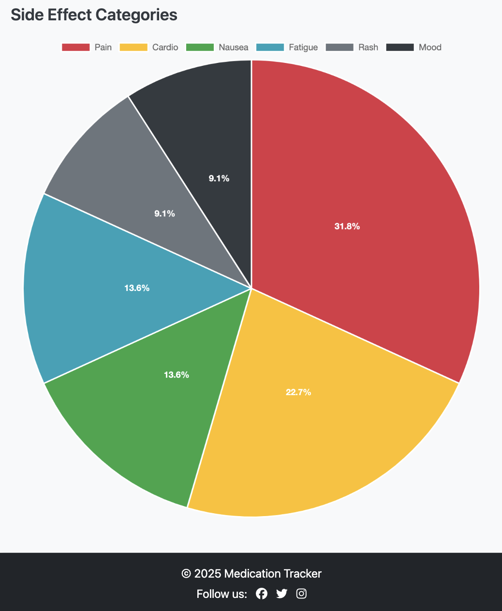
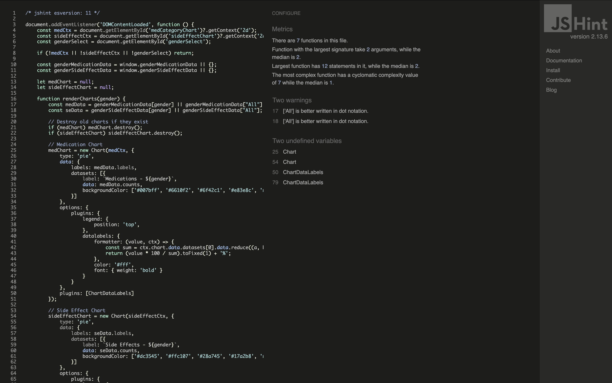
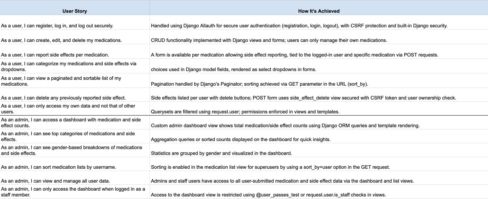

# 💊 Django Medication Tracker

Medication Tracker is a full-stack web application designed to help users efficiently manage and monitor their personal medication schedules with ease, reliability, and privacy. The application provides a secure and user-friendly platform for individuals seeking to stay on top of their medication routines and health management.

Visitors to the site can explore the homepage to learn about the purpose of the app and its core features. To begin tracking their medications, users are required to register for an account through a secure sign-up process. Once registered, users can log in to access the full functionality of the app.

Logged-in users are able to create new medication records, each containing key details such as name, dosage, and frequency. Users can also edit or delete existing entries, ensuring their medication list remains up to date. The platform includes the option to report side effects per medication and categorize both medications and side effects using dropdown fields for clarity and consistency. A responsive, paginated table allows users to easily browse and sort through their current medications.

Admin users benefit from access to a dedicated dashboard that provides an overview of all submitted medications and side effects. The dashboard includes visual summaries of top categories, gender-based breakdowns, and total counts, and enables admins to manage user-generated data effectively. The admin panel, powered by Django, ensures secure and centralized data oversight.

The site’s front end is built with Bootstrap 5, offering a clean and responsive design that performs well across devices. All application data is stored and managed using Django’s robust backend architecture, with role-based authentication and permissions to ensure users can only access and manage their own data.

Overall, Medication Tracker serves as a streamlined and personalized tool for users aiming to support their health routines and improve medication adherence in a secure digital environment.


The live site can be found here: [Medtracker](https://project-4-medication-tracker-4f233b3643e7.herokuapp.com/)

---

## 👤 User Stories

### 👩 Regular User

- **As a user**, I can register, log in, and log out securely.
- **As a user**, I can create, edit, and delete my medications.
- **As a user**, I can report side effects per medication.
- **As a user**, I can categorize my medications and side effects via dropdowns.
- **As a user**, I can view a paginated and sortable list of my medications.
- **As a user**, I can delete any previously reported side effect.
- **As a user**, I can only access my own data and not that of other users.

### 🛡 Admin User

- **As an admin**, I can access a dashboard with:
  - Total medication and side effect counts.
  - Top categories of medications and side effects.
  - Gender-based breakdowns of medications and side effects.
- **As an admin**, I can sort medication lists by username.
- **As an admin**, I can view and manage all user data.
- **As an admin**, I can only access the dashboard when logged in as a staff member.

---

## 📄 Pages & features

### 🧭 Navbar

The application features a responsive and role-aware navigation bar present across all main user-facing pages. Key characteristics include:

- Dynamic Links:
  Links in the navbar adjust based on the user’s authentication status:

    - Logged-out users see: Login, Register.

    - Logged-in users see: Medications, Logout, and optionally their username or profile link.

    - Admin users see an additional link to the Admin Dashboard.

- Styling:
  The navbar is styled using Bootstrap classes for responsiveness and includes clear visual cues for active pages.

- Accessibility & UX:
  Mobile-friendly with a collapsible menu (navbar-toggler) and ARIA attributes for better screen reader support.

<details>
  <summary>Navbar</summary>


  </details>

<details>
  <summary>Navbar admin</summary>


  </details>

<details>
  <summary>Navbar user</summary>



  </details>

---

### 🦶 Footer

A consistent footer is displayed across all views with the following features:

- Minimal Design:
  A simple, fixed (or sticky) footer that displays copyright.

- Dynamic Year:
  Uses Django’s template tags or context processors to render the current year automatically.

- Attribution & Branding (optional):
  You may include site name, developer credit, or links to external documentation (e.g., GitHub repo, API info).

<details>
  <summary>Footer</summary>


  </details>

---

### 🏠 Home Page

The home page is accessible to all users, including those not logged in. It provides an overview of the application's purpose and features, encouraging users to register or log in to access full functionality. It offers detailed information about the application's benefits and how it assists users in managing their medications effectively.

- Django’s built-in authentication system handles registration, login, and logout.

- Medication and side effect data are filtered by the authenticated user — no other users can access or modify my data.

- Access control is enforced through LoginRequiredMixin and @login_required.

<details>
  <summary>Home Page</summary>


  </details>

<details>
  <summary>Home Page User</summary>


  </details>

<details>
  <summary>Home Page Admin</summary>


  </details>

---

## 👤 User Management

### Registration & Signup

New users register with a comprehensive signup form extending Django Allauth’s default signup by requiring first name, last name, gender, age, and country of residence. Gender is selected from predefined choices: Male, Female, or Other. Country selection leverages the `django-countries` package, presenting a dropdown list of countries for standardized input. Age is entered as a positive integer. These fields are saved in an associated `UserProfile` model linked to the user account.

<details>
  <summary>Signup</summary>


  </details>

### Login

Users log in using their email and password credentials. Validation ensures secure authentication with appropriate error feedback.

<details>
  <summary>Login</summary>


  </details>

### Logout

Authenticated users can securely log out via the navigation bar. When clicked, a confirmation prompt ensures the user truly intends to sign out, helping to prevent accidental logouts. Upon confirmation, the session ends and the user is redirected to the homepage,

<details>
  <summary>Logout</summary>


  </details>

---

## 💊 Medication page

The Medication List page serves as the central hub where users can view all medications they have added. Each entry displays key details such as name, dosage, frequency, and treatment duration. Users can also report side effects, edit or delete medications, and view grouped side effects per medication. Admins can see all users' medications, while regular users only see their own.

<details>
  <summary>Medication user</summary>



  </details>

<details>
  <summary>Medication admin</summary>



  </details>

<details>
  <summary>Medication pagination</summary>


  </details>

## 💊 Create, update and delete medications

- **Add Medication!** Users manage their medications through a user-friendly interface. Users add medications by filling a form with fields for medication name, dosage (e.g., “500mg”), frequency (times per day), start and end dates, and selecting a health category from a dropdown list. Categories include Joints and Muscles, Gut Health, Skin, Eyes-Ears-Nose-Throat, Headaches and Dizziness, and Heart Health, ensuring consistent classification of medication purposes. They are able to record, edit, or remove medications they are taking to keep track of treatment accurately.

<details>
  <summary>Add Medication</summary>


  </details>

- **Edit & Delete:** Users can update or remove medications they previously added. Forms are pre-populated with current data for ease of editing. Deletions prompt confirmation to prevent accidental loss.

#### Features

- CreateView (MedicationCreate) allows logged-in users to add new medications.

- UpdateView (MedicationUpdate) allows users to edit only their own medications (or admins).

- DeleteView (MedicationDelete) allows users (or admins) to delete medications with confirmation.

- Medication data includes:

  - Name, Dosage, Frequency, Start/End Date, Category (dropdown), and optional Notes.

- Uses custom-styled form widgets (Bootstrap) for a clean UI.

### ⚠️ Reporting of side effects per medication

As seen in the previous screenshots users are able to log any side effects they experience for specific medication so that they can track how treatments affect them. Users are able categorize side effects from a predefined list to ensure consistency and ensure that reporting is made easier.

<details>
  <summary>Report side effect</summary>


  </details>

<details>
  <summary>Visual of reported side effect</summary>


  </details>


#### Features

- From the medication list page, users can report side effects using the SideEffectForm.

- Each side effect is:

  - Linked to a specific medication.

  - Categorized via dropdown (SIDE_EFFECT_CATEGORIES): Nausea or Vomiting, Fatigue or Weakness, Rashes or Skin Issues, Mood Changes, Muscle or Joint Pain, Heart Palpitations or Chest Pain.

  - Users provide detailed textual descriptions explaining their symptoms or experiences.

- Reported side effects are stored with timestamps (reported_on) and associated with the reporting user.

### View medication and side effect lists

- The app displays medications in a paginated list, showing all relevant details. Each medication is tied to the logged-in user, enforcing privacy, while also allowing quick access and monitoring.

#### Features

- MedicationList displays:

  - User’s medications (or all for superusers).

  - Paginated with 6 items per page.

  - Includes sorting by name, user (admin only), and date created.

- Side effects are grouped and displayed under each medication using a dictionary (side_effects_by_med).

### Delete side effect lists

- Users are able to remove a previously reported side effect if it was added in error.

#### Features

- SideEffectDelete view provides deletion with access restricted to the original reporter.

- Confirmation template ensures no accidental deletions.

---

### Admin dashboard overview

- Admin users have access to a dashboard that gives me insight into medication and side effect usage patterns across all users.

#### Features

- Access restricted via @staff_member_required.

- Dashboard displays:

  - Total number of medications and side effects. The dashboard displays overall counts of medications and side effects recorded.

  - Top medication and side effects categories (global and by gender). Data is grouped by health categories for medications and side effect categories, showing the most common entries.

<details>
  <summary>Admin Dashboard Medications</summary>


  </details>

<details>
  <summary>Admin Dashboard Sideffect</summary>



  </details>

- Admins are capable to analyze medication and side effect trends based on users' genders to understand how experiences vary. Data is grouped by Male, Female or Other. The visual grouping structure is prepared (gender_medication_data, gender_side_effect_data) and includes an “All” group for comparison across entire dataset.

- The graphs uses raw SQL queries for performance and flexibility. While I understand Django’s ORM is powerful and simplifies most database interactions, I chose to use raw SQL in parts of this project particularly in the admin dashboard. This wasn’t just for performance and flexibility, but because in this project I wanted to highlight my ability to write and work with SQL directly.

While I understand that it would’ve been easier to do everything using the ORM, I think including raw SQL allowed me to handle more complex queries and aggregations efficiently, like joining user profiles with medications and side effects based on gender. This was a great opportunity to demonstrate that I’m comfortable stepping outside the ORM when needed and understand what’s going on.

<details>
  <summary>Admin Dashboard Filter for medications</summary>


  </details>

<details>
  <summary>Admin Dashboard Filter for side effects</summary>


  </details>

---

## Security and access control

Only authenticated users can:

    View their own medication list.

    Add, update, or delete medications and side effects.

Only superusers/admins can:

    View all medications from all users and sort by username. date or medication.

    Access the admin dashboard.

Permissions enforced via:

    LoginRequiredMixin

    UserPassesTestMixin

    @login_required

    @staff_member_required

---

## 📊 Data Model

The Medication Tracker project includes the following main models:

### User
- Django's built-in user model.
- Linked to UserProfile, Medication, and SideEffect.

### UserProfile
- One-to-one relationship with User.
- Stores user-specific metadata like gender, age, and country.

### Medication
- ForeignKey to User.
- Represents a specific medication with fields like name, dosage, frequency, etc.

### SideEffect
- ForeignKey to both Medication and User.
- Represents side effects experienced while taking a medication.

### Relationships Summary
- One User ➝ One UserProfile
- One User ➝ Many Medications
- One Medication ➝ Many SideEffects
- One User ➝ Many SideEffects

### ERD (Entity Relationship Diagram)


---

## Additional Features and Possibilities

### 🧬 User Profile Integration

Gender, age, and country are stored in a UserProfile model (via OneToOneField).

Enables demographic filtering (e.g., gender-based dashboard data).

Future potential:

    Localized medication advice.

    Age-specific health recommendations.

### 🌍 Country Data Support

CountryField allows easy integration of internationalization (e.g., filter medication by region or create country-based analytics).

### ✅ Future Suggestions

Allow users to export their medication logs (PDF/CSV).

Add reminders or alerts for medication schedules.

Include file uploads (e.g., prescriptions, images of side effects).

Allow doctor/caregiver roles to view assigned users' data.

Make use of Django signals to automatically create user profiles on registration.

---

## 🎨 Project Design

This project combines clean visual design with full CRUD functionality to ensure an intuitive and user-friendly experience.

### 🛠 CRUD Functionality

The system is designed around standard Create, Read, Update, and Delete (CRUD) operations:

- Users can create and manage medications and report side effects.

- All entries can be viewed in list format, filtered and grouped for clarity.

- Items can be updated or deleted directly from the interface, with appropriate permission checks to ensure data integrity.

### 🌈 Color Scheme

- A minimal and accessible color palette is used, prioritizing readability and contrast.

- Bootstrap's default theme is extended with subtle custom styling for buttons, alerts, and form elements.

### 🔤 Typography

- The project uses Bootstrap’s base typography, which provides clean, responsive, and legible text styling across all devices.

- Headings and body text are clearly distinguished, with consistent font sizes and weights.

- Placeholders and form hints use smaller, muted text for subtle guidance without clutter.

### 🖼 Layout & Responsiveness

- The layout is mobile-first and fully responsive, built using Bootstrap’s grid system.

- Forms and lists resize smoothly across screen sizes — from phones to desktops.

- Navigation and tables adapt gracefully to small screens, maintaining usability.

### 🧭 UI Components

Common UI patterns are used to improve familiarity, including:

- A sticky navbar.

- Consistent form design.

- Flash messages (e.g., success/error alerts).

- Dropdowns for selecting categories.

---

## Wireframes

Wireframes were created in Uiwizard. They were used for initial planning of template layouts.

<details>
<summary>Index Wireframe</summary>


</details>

<details>
<summary>Medication Wireframe</summary>


</details>

<details>
<summary>Admin Dashboard Wireframe</summary>


</details>

<details>
<summary>Registration Page Wireframe</summary>


</details>

---

## Agile Methodology

[GitHub Projects Page](https://github.com/users/aaronalonsotorrens/projects/4)

GitHub Projects was used in part for the planning of this website to create and track User Stories as they were implemented and fulfilled.

<details>
<summary>Agile plan document</summary>


</details>

<details>
<summary>Github document</summary>


</details>

<details>
<summary>Kanban board setting to public</summary>


</details>

---

# Technologies Used

- [HTML5](https://en.wikipedia.org/wiki/HTML5) – Markup language for structuring content.
- [CSS3](https://en.wikipedia.org/wiki/CSS) – Styling language; limited use due to Bootstrap.
- [Bootstrap](https://getbootstrap.com/) – Frontend framework for responsive design.
- [JavaScript](https://www.javascript.com/) – For interactive elements (light use, possibly inline).
- [Python 3](https://www.python.org/) – Main programming language.
- [Django 3.2](https://www.djangoproject.com/) – Web framework used for backend development.
  - [Django Crispy Forms](https://pypi.org/project/django-crispy-forms/) – Enhanced form rendering.
  - [Crispy Bootstrap5](https://pypi.org/project/crispy-bootstrap5/) – Bootstrap 5 template pack.
  - [Django Widget Tweaks](https://pypi.org/project/django-widget-tweaks/) – For customizing form field rendering.
  - [Coverage](https://github.com/nedbat/coveragepy/tree/6.5.0): for measuring code coverage of Python tests.
- [Cloudinary](https://cloudinary.com/) – For hosting uploaded media (if used).
- [Git](https://git-scm.com/) – Version control.
- [GitHub](https://github.com/) – To host the repository.
- [Gitpod](https://www.gitpod.io/) – Online IDE used for development.
- [Heroku](https://www.heroku.com/) – Deployment platform.
- [Google Fonts](https://fonts.google.com/) – For custom fonts.
- [Font Awesome](https://fontawesome.com/) – Icon set used in UI.
- [Uiwizard](https://uizard.io/) – To create the wireframes for the project.
- [Dbdiagram](https://dbdiagram.io/) – To create an entity relationship diagram (ERD).

---

# Testing

## [HTML Validator](https://validator.w3.org/)

HTML was validated by copying the page source and pasting into the validator.

<details>
<summary>Home Page Results</summary>


</details>

<details>
<summary>Add Medication Results</summary>


</details>

<details>
<summary>View Medication Results</summary>


</details>

<details>
<summary>Dashboard Results</summary>


</details>

<details>
<summary>Signup Results</summary>
There were 4 warnings related to CountryField django package. Nothing else shows errors.


</details>

<details>
<summary>Signin Results</summary>


</details>

<details>
<summary>Signout Results</summary>


</details>

---

## [CSS Validator](https://jigsaw.w3.org/css-validator/)

The overall look and feel of the site is driven primarily by Bootstrap’s responsive utility classes and Django’s built-in features. Leveraging Bootstrap allowed for a modern, streamlined layout that minimized the need for redundant styling while still delivering a clean, polished, personal and user-friendly interface, something I really enjoyed working on.

In contrast, the forms.html template includes custom CSS styling via a separate stylesheet, which was validated with zero errors. This allowed for more precise control over specific layout and design elements where needed.

<details>
<summary>CSS validations for forms.css</summary>


</details>

---

## JavaScript Testing

JSHint was used for validating the JavaScript.

<details>
<summary>Script js testing</summary>



</details>

---

## Python Testing

The project was tested for pep8 compliance using pycodestyle. [autopep8](https://pypi.org/project/autopep8/) was used to aid compliance. At time of writing no problems or errors were found.

---

## Lighthouse

The site was tested using Lighthouse in Chrome DevTools to check performance, accessibiltiy, best practices and SEO. The final testing on Lighthouse was run on incognito mode. The results are below.

<details>
<summary>Home page results</summary>


</details>

<details>
<summary>Medications admin results</summary>


</details>

<details>
<summary>Medications user results</summary>


</details>

<details>
<summary>Add medication results</summary>


</details>

<details>
<summary>Signin Results</summary>


</details>

<details>
<summary>Signout Results</summary>


</details>

<details>
<summary>Signup Results</summary>


</details>

---

## Automated Testing

This project includes automated tests for the medications app, ensuring key components function correctly and reliably. The tests are written using Django’s testing framework and cover the following areas:

- Form Validation Tests
    - MedicationForm:

        - Validates that the form accepts correct and complete data.

        - Ensures the form rejects submissions with missing or invalid fields.

    - SideEffectForm:

        - Validates correct data inputs.

        - Checks that forms with empty or invalid data are rejected.

- View Tests
    - Medication List View:

        - Confirms the view loads successfully for authenticated users.

        - Checks the correct template is used to render the medication list page.

        - Verifies user login is required (via test setup with logged-in user).

If I had more time, I would have extended automated testing to cover the remaining Python files and views across the project. Expanding test coverage was planned to further ensure robustness and maintainability.

<details>
<summary>Automated testing with coverage reports</summary>


</details>

---

## Manual Testing

Below the steps for manual testing of the site have been arranged into tables.

<details>
<summary>Manual testing</summary>


</details>

<details>
<summary>User story testing</summary>


</details>

---

## Browser Compatibility
The website was tested on:
- Chrome Version
- Firefox Version 
- Safari iOS 

---

## Deployment
### Steps to deploy site using Heroku:

- Ensure that `gunicorn`, `dj_database_url`, `psycopg2`, and `dj3-cloudinary-storage` are installed
- On the Heroku dashboard, click **New** then select **Create new app**
  - Enter a unique app name — this will be added to `ALLOWED_HOSTS` in your Django settings
  - Select the appropriate region
  - Click **Create app**
- Navigate to the **Resources** tab:
  - Search for **postgres** in the add-ons search bar and select **Heroku Postgres**
  - Click **Submit Order Form**
- Go to the **Settings** tab:
  - Scroll down to **Config Vars** and click **Reveal Config Vars**
  - `DATABASE_URL` will be automatically set after adding Heroku Postgres — copy this value for your project
  - Add a new config var for `SECRET_KEY` — generate your own or use a Django secret key generator
  - Add a new config var for `CLOUDINARY_URL` — copy the "API Environment variable" from your Cloudinary dashboard, but remove the `CLOUDINARY_URL=` prefix
  - Add a new config var named `DISABLE_COLLECTSTATIC` with value `1` — this will be removed before final deployment
- In your project directory:
  - Create a new file named `env.py` at the top-level
  - Inside `env.py`:
    - Import os
    - Add 'os.environ["DATABASE_URL"] = "Enter the DATABASE_URL from the Heroku app here"'
    - Add 'os.environ["SECRET_KEY"] = "Enter your new secret key here"'
    - Add 'os.environ["CLOUDINARY_URL"] = "Enter your CLOUDINARY_URL as in the Heroku app here"'
```
import os

  os.environ['DATABASE_URL'] = 'postgres://exampledatabaseurl'
  os.environ['SECRET_KEY'] = 'examplesecretkey'
  os.environ['CLOUDINARY_URL'] = 'cloudinary://examplecloudinaryurl'
  ```
  - If not already present, create a .gitignore file and add env.py to it

- In your project, in settings.py:
  - Import os
  - Import dj_database_url
  - Import env file
  ```
  import os
  import dj_database_url
  if os.path.isfile('env.py'):
      import env
  ```
  - Replace the existing SECRET_KEY with:
  ```
  SECRET_KEY = os.environ.get('SECRET_KEY')
  ```
  - Replace or comment out the old DATABASES configuration and add:
	DATABASES = {
			'default': dj_database_url.parse(os.environ.get('DATABASE_URL'))
			}
  ```
  DATABASES = {
        'default': dj_database_url.parse(os.environ.get('DATABASE_URL'))
    }
  ```
  - Update your ALLOWED_HOSTS to include your Heroku app name and localhost:
  ```
  ALLOWED_HOSTS = ['example-heroku-app-name.herokuapp.com', 'localhost']
  ```
  - Add 'cloudinary_storage' above 'django.contrib.staticfiles' and 'cloudinary' below it in INSTALLED_APPS:
  ```
  ...
  'cloudinary_storage',
  'django.contrib.staticfiles',
  'cloudinary',
  ...
  ```
  - Configure static and media files to use Cloudinary:
  ```
    STATIC_URL = '/static/'
	STATICFILES_STORAGE = 'cloudinary_storage.storage.StaticHashedCloudinaryStorage'
	STATICFILES_DIRS = [os.path.join(BASE_DIR, 'static')]
	STATIC_ROOT = os.path.join(BASE_DIR, 'staticfiles')

	MEDIA_URL = '/media/'
	DEFAULT_FILE_STORAGE = 'cloudinary_storage.storage.MediaCloudinaryStorage' --> If you have media to store
  ```
  - Run 'python3 manage.py collectstatic' to collect static files
- In your project:
  - Create a Procfile in the top level directory and add 'web: gunicorn project_name.wsgi' to tell 
  ```
  web: gunicorn project_name.wsgi
  ```
  - Create a requirements file with 'pip3 freeze --local > requirements.txt' for Heroku to install required packages
  ```
  pip3 freeze --local > requirements.txt
  ```
  - Make migrations with 'python3 manage.py migrate'
  ```
  python3 manage.py migrate
  ```
- Commit and push all changes to your GitHub repository
- Before the final deployment:
    - Set DEBUG = False in your settings.py
    - Remove the DISABLE_COLLECTSTATIC config var from Heroku
- On the Heroku dashboard:
    - Go to the Deploy tab
    - Choose GitHub and connect your GitHub account if not connected
    - Search for your repository and click Connect
    - Scroll down to deployment options:
        - Enable automatic deploys if desired, to deploy on every push to GitHub
        - Or deploy manually by selecting the branch and clicking Deploy Branch
    - Heroku will build your app
- After deployment completes:
    - Click Open app at the top of the page to view your live site

---

## Acknowledgements

I would like to express my gratitude to the following for their support and resources during the development of this project:

- **[Code Institute](https://codeinstitute.net/)** – For providing a structured learning environment and valuable tutoring throughout the project.
- **[Django Documentation](https://docs.djangoproject.com/)** – For clear and detailed references that guided the backend development.
- **[Bootstrap Documentation](https://getbootstrap.com/docs/)** – For the powerful and responsive frontend components that shaped the UI.
- **[Stack Overflow](https://stackoverflow.com/)** – For being an essential resource in resolving issues and exploring best practices.
- **[W3Schools](https://www.w3schools.com/)** and **[MDN Web Docs](https://developer.mozilla.org/)** – For reliable explanations of HTML, CSS, and JavaScript concepts.
- **[Font Awesome](https://fontawesome.com/)** – For icon assets that enhanced the visual design and usability.
- **[Chatgpt](https://chatgpt.com/)** – Support with troubleshooting code and project planning.
- **[Github project](https://github.com/SJECollins/ci-pp4-pet-rx)** Very helpful with project structure and organisation.

A special thank you to my mentor Brian Macharia for their constructive feedback and encouragement.

### Additional documentation

* Project draft
  * [Google Sheet](https://docs.google.com/spreadsheets/d/1_4eTeUY9SJVy2AsdiYDelQeH30RATD8YRc7OqEIjHqw/edit?usp=sharing)
* Project manual testing
  * [Google Sheet](https://docs.google.com/spreadsheets/d/1sESh-80ziwv5ejT-GULQ0venPfS0Z_QnpMplK91KGkw/edit?usp=sharing)

---
